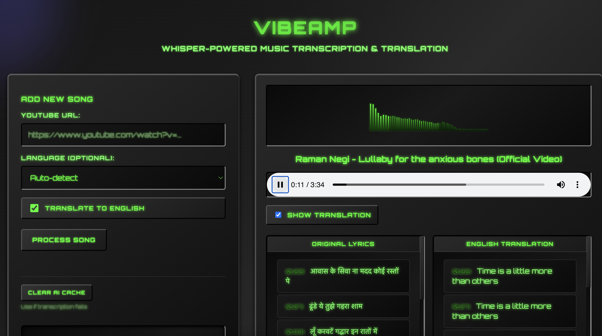

# VibeAmp

VibeAmp is a music transcription and translation web app that downloads audio from YouTube URLs, transcribes lyrics using OpenAI's Whisper model, and provides synchronized playback with optional English translation.




## Setup

1. Install dependencies:
```bash
pip install -r requirements.txt
```

2. Run the Flask application:
```bash
python app.py
```

3. Open your browser to `http://localhost:8000`

## Usage

1. Enter a YouTube URL in the web interface
2. Optionally select language (or use auto-detection)
3. Choose whether to include English translation
4. Click "Process Song" to transcribe
5. Play the audio with synchronized lyrics

## How VibeAmp Works


1. Downloads audio from YouTube URLs using `yt-dlp` and converts to MP3 format
2. Uses OpenAI's Whisper model to automatically detect the audio language
3. Optionally translates non-English lyrics to English using Whisper's translation task
4. Aligns original and translated text segments by timestamp for synchronized playback
5. Saves processed data locally with metadata, lyrics, and audio files for quick re-access

The web interface provides real-time playback with synchronized lyrics display, showing both original and translated text side-by-side when translation is enabled.

## Requirements

- Python 3.8+
- FFmpeg (for audio processing)
- Internet connection (for YouTube downloads and Whisper model)
